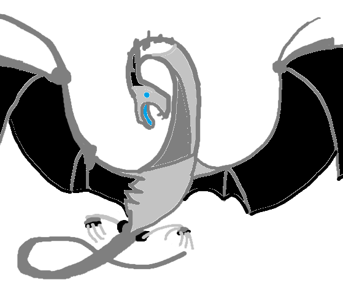
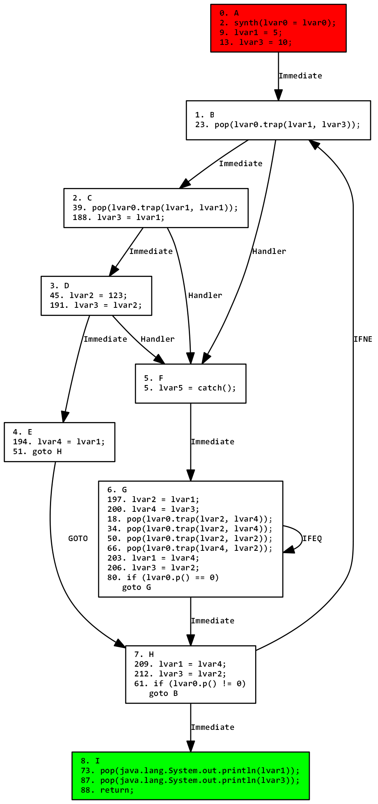

# Maple-IR

Maple-IR is a industrial IR-based static analysis framework for Java bytecode.
Currently, it implements SSA-form based analysis as well as construction and destruction from bytecode to IR.
The toolchain takes bytecode input, lifts it to SSA IR, transforms the IR, then recompiles back down to bytecode.
This is done by symbolically executing each method while simulating the stack, similar to how Binary Ninja or IDA Pro's Hex-Rays operate.
Intraprocedural data-flow analysis is fully implemented, and optimizations such as constant folding and copy propogation are implemented as well.
A CFG Graphviz exporter is also available; see below for examples.

Maple-IR is not in active development. It is on hiatus indefinitely, although code contributions are welcome.
Please file questions, comments, and issues on the [issue tracker](https://github.com/LLVM-but-worse/maple-ir/issues).

Maple-IR in its current form is not yet production-ready, although it can be made so with little effort.



*"It's like LLVM, but worse."*

## Technical details
SSA destruction is implemented using the methods of [Sreedhar et al.](https://pdfs.semanticscholar.org/b4e0/f3301cffb358e836ee2964a0316e1b263974.pdf) and [Boissinot et al.](https://hal.inria.fr/inria-00349925/file/RR.pdf). The Boissinot destructor is currently the default destructor.
SSA construction is implemented based on a fast 1-pass linear scan algorithm loosely based on Cytron et al.'s method using dominance frontiers. For more details see [SSAGenPass.java](https://github.com/LLVM-but-worse/maple-ir/blob/master/org.mapleir.ir/src/main/java/org/mapleir/ir/cfg/builder/SSAGenPass.java).
Bytecode destruction is tricky in Java due to exception ranges. Furthermore, linearizing the control flow graph (CFG) in a simple manner is difficult due to loop nesting. Linearization is handled by recursively applying Tarjan's superconnected components algorithm. Exception tables for each method are discarded and regenerated based on the control flow graph's structure. For more details, see [ControlFlowGraphDumper](https://github.com/LLVM-but-worse/maple-ir/blob/master/org.mapleir.ir/src/main/java/org/mapleir/ir/algorithms/ControlFlowGraphDumper.java).

## Screenshots and examples
Here is the Graphviz visualization for the optimized, destructed (non-SSA) IR for the following code:

```java
void test130() {
    int x = 5;
    int y = 10;

    do {
        try {
            trap(x, y);
            y = x;
            trap(x, y);
            y = 123;
        } catch (RuntimeException e) {
            do {
                trap(x, y);
                int z = y;
                trap(x, y);
                y = x;
                trap(x, y);
                x = z;
                trap(x, y);
            } while(!p());
        }
    } while(p());

    System.out.println(x);
    System.out.println(y);
}
```



---
Here is a nastier function, in optimized SSA form, taken from the Fernflower decompiler:


## Caveats
- Since the project uses a fork of the ObjectWeb ASM framework, it's not compatible with other implementations. This should be addressed before you use maple-ir as a library.
- Interprocedural analysis has not been fully implemented (it's difficult).

## Compiling
To build:
```
cd org.mapleir.parent
mvn compile
mvn package
```

## Credits
 - [Bibl](https://github.com/TheBiblMan)
 - [ecx86](https://github.com/ecx86)
 - [ObjectWeb ASM framework](http://asm.ow2.org/index.html) (forked).
 - [Google Gson](https://github.com/google/gson)

Contact: `ecx` or `bibl` [at] `mapleir.org`

**sharing will lead to reported and beat down** (bless)

## License
Maple-IR is licensed under the GPLv3. For more information, please see [here](https://www.gnu.org/licenses/gpl-3.0.en.html).

Copyright (c) 2018 Bibl and ecx86
